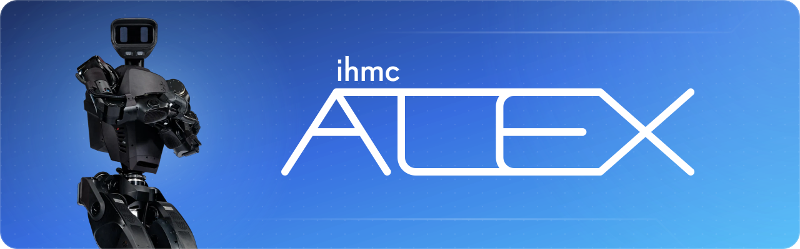

<p align="center"></p>

# ihmc-alex-sdk
Robot models, hardware configuration, and ROS 2 messages for the [IHMC](https://robots.ihmc.us/) Alex Humanoid.

```
git clone --recurse-submodules https://github.com/ihmcrobotics/ihmc-alex-sdk.git
```

## Contents
| Directory | What's in it |
|---|---|
| `alex_description` | ROS 2 description package with single-file URDFs and meshes, for RViz, MoveIt, Pinocchio, etc. |
| `alex-models/alex_virtual_description` | Per-segment URDFs and meshes (V2), used by IHMC software |
| `alex-models/alex_hardware_description` | Hardware configuration for each unit (e.g. `001_xml_description`) and each actuator package |
| `alex-ros2/alex_msgs` | ROS 2 messages for commanding the robot and reading its state, with generated Java bindings |
| `alex-ros2/ihmc_hands_ros2` | Submodule with the hand models and messages |
| `utils` | Scripts for generating the URDFs, collision meshes, and README banner |

## Using the URDF
Put `alex_description` in a colcon workspace's `src` directory, then:
```
colcon build --packages-select alex_description
source install/setup.bash
ros2 launch alex_description display.launch.py  # model:=alex_v2.wholeBody_convex.urdf for no hands
```

`alex_description` is generated from the segment URDFs. Don't edit it by hand. After changing a segment, run
`python3 utils/generate_alex_description.py` and commit the result. CI fails if it's out of date.

## Using from Java
```kotlin
api("us.ihmc:ihmc-alex-sdk:0.4.0")
```

## Maintainers
* Stefan Fasano (sfasano@ihmc.org)
* Reese Peterson (rpeterson@ihmc.org)
* Dexton Anderson (danderson@ihmc.org)
* Robert Griffin (rgriffin@ihmc.org)
